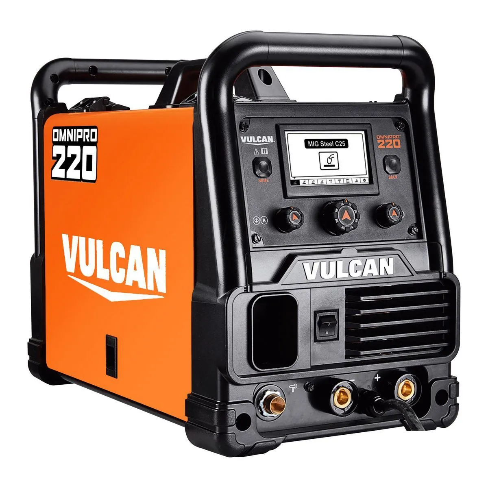
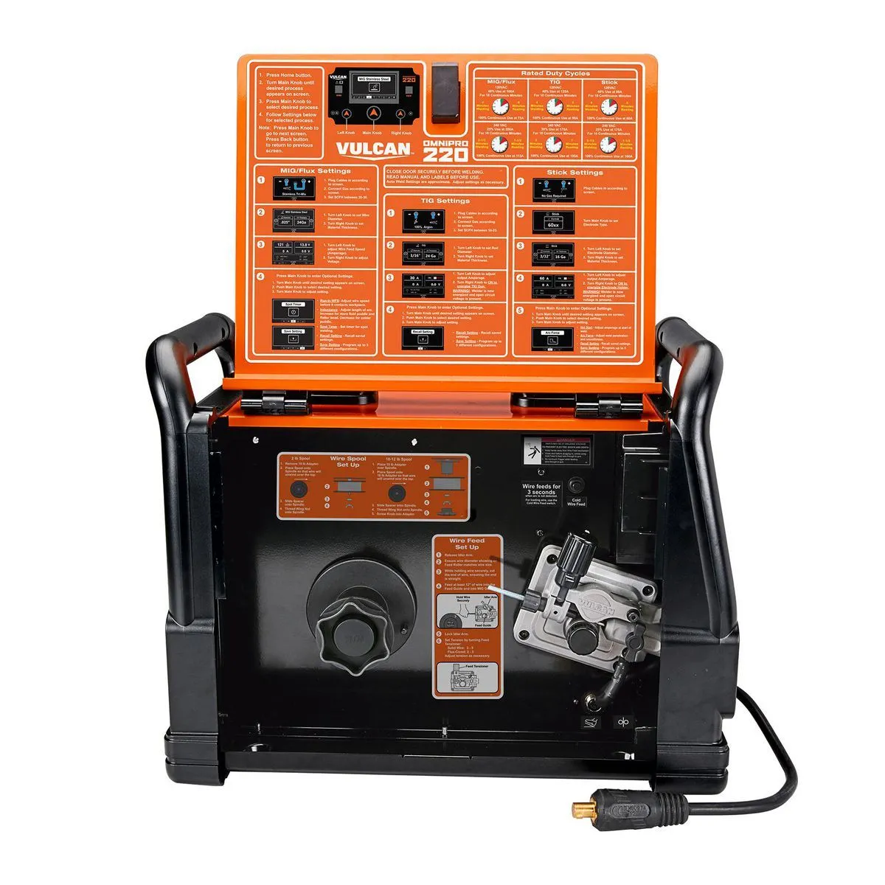

# OmniPro 220 Technical Support Agent

 

A multimodal AI-powered technical support application for the **Vulcan OmniPro 220** multiprocess welder. Ask questions about setup, settings, troubleshooting, specifications, and more — get grounded answers with manual citations, visual diagrams, interactive widgets, and page image evidence.

Built for the [Prox Founding Engineer Challenge](https://useprox.com/join/challenge).

## Live Demo

Not deployed yet in this repository snapshot. Run locally with the Quick Start below.

## Quick Start

```bash
git clone https://github.com/ibz-arain/prox-challenge.git
cd prox-challenge
cp .env.example .env   # Add your ANTHROPIC_API_KEY
npm install
npm run dev                    # Opens at http://localhost:3000
```

That's it. The search index auto-builds on your first query. Alternatively, pre-build it:

```bash
npm run ingest                 # Extracts text from PDFs, builds search index
```

## LLM configuration

The app uses `@anthropic-ai/sdk` directly against Anthropic.

**Quick setup:** put your Anthropic key in `ANTHROPIC_API_KEY` (get one from [Anthropic Console](https://console.anthropic.com/)).

| Variable | Purpose |
|----------|---------|
| `ANTHROPIC_API_KEY` | Primary key used for chat + vision ingestion |
| `LLM_MAX_TOKENS` | Optional; default **4096** per completion |

**Model:** The app uses **Claude Sonnet 4** (`claude-sonnet-4-20250514`).

**Structured outputs:** Tool results and citations come from this app. `<artifact>` tags depend on the model following the prompt, and Claude is the expected runtime model for artifact-heavy answers.

## Why This Product Is Hard

The OmniPro 220 manual is 48 pages of dense technical content spanning four welding processes (MIG, Flux-Cored, TIG, Stick), two input voltages (120V/240V), complex polarity configurations, duty cycle matrices, wire feed mechanisms, troubleshooting matrices, and weld diagnosis diagrams.

Key challenges:
- **Cross-referencing**: Answering "what polarity for TIG?" requires finding the polarity table, the TIG setup section, and the physical connection diagram across different pages
- **Visual-only content**: Some critical info (selection charts, wiring schematics, weld diagnosis photos) exists only as images in the PDF
- **Ambiguous questions**: "Help me choose settings" requires knowing the welding process, material, thickness, and input voltage — the agent must ask follow-up questions
- **Multi-format answers**: A polarity question is best answered with a diagram, a duty cycle question with a table, and a troubleshooting question with a flowchart

## Architecture

```
┌──────────────────────────────────────────────────────────────────┐
│                        Next.js App Router                        │
├─────────────┬────────────────────────┬──────────────────────────┤
│   Sidebar   │      Chat Panel        │    Evidence Panel         │
│             │                        │                          │
│  Product    │  Message Bubbles       │  Source Citations         │
│  Info       │  (Markdown + Artifacts)│  Page Image Previews     │
│             │                        │  Artifact Cards           │
│  Sample     │  Image Upload          │  (Tables, Diagrams,      │
│  Prompts    │  Text Input            │   Flowcharts, Calculators)│
│             │                        │                          │
│  Index      │                        │                          │
│  Status     │                        │                          │
└─────────────┴────────────────────────┴──────────────────────────┘
                           │
                    POST /api/chat
                           │
              ┌────────────▼────────────┐
              │     Agent Loop          │
              │                         │
              │  1. System Prompt       │
              │  2. Claude API Call     │
              │  3. Tool Execution      │──── search_manual
              │  4. Loop until done     │──── get_page
              │  5. Parse artifacts     │──── get_page_image
              │  6. Stream SSE events   │──── lookup_specs / get_diagram
              │     response            │
              └────────────┬────────────┘
                           │
              ┌────────────▼────────────┐
              │     Data Layer          │
              │                         │
              │  MiniSearch Index       │
              │  Page Text (JSON)       │
              │  Page Images (PNG)      │
              └─────────────────────────┘
```

### Tech Stack

| Layer | Technology | Why |
|-------|-----------|-----|
| Framework | Next.js 15 (App Router) | Full-stack React with API routes, fast DX |
| Language | TypeScript (strict) | Type safety across agent/API/frontend |
| Styling | Tailwind CSS 4 | Rapid, consistent dark-mode UI |
| AI | Anthropic SDK (Messages API) | Claude-powered tool use and multimodal responses |
| PDF Processing | pdfjs-dist (Mozilla pdf.js) | Pure-JS PDF text extraction, no system deps |
| Search | MiniSearch | Zero-dependency in-memory full-text search |
| Rendering | react-markdown + custom components | Rich artifact rendering (SVG, tables, flowcharts) |

### Why the Standard SDK Over the Agent SDK

The Anthropic Claude Agent SDK (`@anthropic-ai/claude-agent-sdk`) is the Claude Code runtime harness — designed for autonomous coding agents with filesystem/bash access. For a web-based technical support chat, the standard `@anthropic-ai/sdk` with Messages API tool use gives us the right abstraction: full control over tool execution, response formatting, and web-compatible request/response patterns.

Our agent loop implements the same agentic pattern (system prompt → tool calls → loop → response) with tools purpose-built for manual retrieval and structured output generation.

## Knowledge Extraction

### Ingestion Pipeline

1. **PDF Parsing**: `pdfjs-dist` extracts text page-by-page from all PDFs in `files/`
2. **Vision Fallback**: Pages with little/no text (<50 chars) are rendered and sent to Claude Vision for structured extraction (fixes `selection-chart.pdf`)
3. **Section Detection**: Heuristics classify each page (safety, setup, specs, troubleshooting, polarity, welding-process, maintenance, parts)
4. **Content Type Detection**: Pages are tagged as text, table, diagram, or mixed based on line patterns
5. **Search Index**: MiniSearch builds a TF-IDF/BM25 index with fuzzy matching, prefix search, and field boosting
6. **Page Images**: `npm run ingest` pre-renders critical pages to `public/manual-pages/`; dynamic full-page cache is optional

All processed data is stored in `generated/` (gitignored, auto-built on first query).

### Retrieval Strategy

- **Full-text search** with MiniSearch — returns ranked pages with relevance scores
- **Section filtering** — agent can narrow searches to specific sections (e.g., only troubleshooting pages)
- **Fuzzy matching** — handles misspellings and partial terms
- **Multi-query** — agent typically runs 2-3 searches per question, refining terms based on initial results
- **Page-level granularity** — each result maps to a specific manual page with full text

## Multimodal Rendering

The agent returns markdown with embedded `<artifact>` tags. The frontend parses these and renders them with dedicated React components:

| Artifact Type | Component | Use Case |
|--------------|-----------|----------|
| `table` | TableArtifact | Duty cycle matrices, settings tables, spec comparisons |
| `svg-diagram` | DiagramArtifact | Polarity diagrams, cable connections, socket placement |
| `flowchart` | FlowchartArtifact | Interactive troubleshooting decision trees |
| `calculator` | CalculatorWidget | Duty cycle, thermal-rest, gas-flow sliders, settings configurator (`type` in JSON) |
| `settings-card` | SettingsCard | Recommended welding parameter cards |
| `step-list` | StepListArtifact | Ordered setup / maintenance steps (JSON `steps` array) |
| `artifact-html` | HtmlArtifact | Safety callouts, checklists, custom HTML/CSS |

### Evidence Panel

Every response populates a right-side evidence panel with:
- **Source citations** — page number, document name, relevant excerpt
- **Page image previews** — actual manual page renders (clickable to expand)
- **Artifacts** — any generated tables, diagrams, or widgets

## Agent Behavior

The Claude agent follows these principles:
- **Search when needed** — for new questions, queries the manual index; skips redundant searches when the thread already has a complete, cited answer
- **Cite sources** — every answer references specific pages
- **Ask when uncertain** — if the question is ambiguous or evidence is weak, asks a clarifying question
- **Safety-aware** — includes relevant safety warnings without being preachy
- **Visual when helpful** — generates SVG diagrams for connection questions, tables for data, flowcharts for troubleshooting
- **Canonical diagrams first** — for polarity/connection questions, it can call `get_diagram` for consistent, hardcoded SVGs
- **User-appropriate tone** — assumes a smart garage buyer, not a professional welder

## Example Prompts

Try these to explore the agent's capabilities:

| Prompt | Expected Response |
|--------|------------------|
| "What's the duty cycle for MIG welding at 200A on 240V?" | Table with duty cycle data, page citation |
| "I'm getting porosity in my flux-cored welds" | Troubleshooting flowchart or checklist |
| "What polarity setup for TIG welding?" | SVG diagram showing cable connections |
| "Show me which socket the ground clamp goes in" | Page image + diagram |
| "Help me choose settings for 1/8\" mild steel" | Settings card or configurator widget |
| "What's the difference between 120V and 240V modes?" | Comparison table with specs |

## Hard Questions the Agent Handles Well

### 1) Process/material/thickness settings lookup
**Q:** "Help me choose settings for 1/8 inch mild steel on 240V."  
**A:** Retrieves selection-chart rows (via vision-extracted text), proposes voltage/wire-speed/gas/polarity values in a settings card, and cites exact manual pages.

### 2) Polarity + physical connection correctness
**Q:** "What polarity do I need for TIG welding?"  
**A:** Uses canonical TIG polarity SVG (`get_diagram`), explains torch/ground terminal mapping, adds safety warning, cites source page, and shows page evidence.

### 3) Troubleshooting with visual/manual evidence
**Q:** "I'm getting porosity in my flux-cored welds. What should I check?"  
**A:** Returns structured checks in priority order (gas, stickout, prep, contamination), optionally flowcharts the decision path, and links troubleshooting pages/photos.

## Project Structure

```
├── app/
│   ├── layout.tsx              # Root layout
│   ├── page.tsx                # Three-panel main UI
│   ├── globals.css             # Tailwind + dark theme
│   └── api/
│       ├── chat/route.ts       # Chat endpoint (agent loop)
│       ├── status/route.ts     # Ingestion status
│       └── pages/[source]/[page]/route.ts  # Page images
├── components/
│   ├── chat/                   # Chat panel, messages, input
│   ├── evidence/               # Citation cards, page previews
│   ├── artifacts/              # Table, diagram, flowchart renderers
│   └── Sidebar.tsx             # Product info, sample prompts
├── lib/
│   ├── agent/                  # Claude agent loop, tools, system prompt
│   ├── ingest/                 # PDF parsing, indexing, page rendering
│   ├── retrieval/              # Search interface
│   └── types.ts                # Shared TypeScript types
├── scripts/
│   ├── ingest.ts               # CLI ingestion pipeline
│   └── eval.ts                 # Retrieval evaluation harness
├── files/                      # PDF manuals
└── generated/                  # Processed data (auto-built)
```

## npm Scripts

| Script | Command | Description |
|--------|---------|-------------|
| `dev` | `npm run dev` | Start dev server at localhost:3000 |
| `build` | `npm run build` | Production build |
| `ingest` | `npm run ingest` | Pre-process PDFs and build search index |
| `eval` | `npm run eval` | Run retrieval evaluation test suite |
| `lint` | `npm run lint` | ESLint check |

## Limitations & Future Improvements

### Current Limitations
- **No vector embeddings** — uses keyword-based search (TF-IDF/BM25), not semantic embeddings. Good enough for a 50-page corpus but would benefit from embeddings for nuanced queries.
- **Vision ingestion depends on API access** — if no Anthropic key is set, image-only pages cannot be vision-extracted.
- **Dynamic full-page rendering can be unavailable** — static critical page images are still served, and evidence falls back to text excerpts when an image is missing.

### Future Improvements
- **Voice input/output** — natural voice interaction for hands-free use while welding
- **Persistent conversations** — save and resume chat sessions
- **Hosted deployment** — Vercel/Railway deployment for zero-setup demo access
- **Expanded widget library** — wire feed tension calculator, gas flow calculator, cost estimator

## Design Rationale

This architecture prioritizes **reviewer experience** and **demo quality** over infrastructure sophistication:

1. **Single app, zero external deps** — no Docker, no databases, no vector stores. Just `npm install` and go.
2. **Auto-ingestion** — the index builds automatically on first query, so reviewers don't need a separate setup step.
3. **Purpose-built agent tools** — instead of generic RAG, the agent has domain-specific tools (`search_manual`, `get_page`, `get_page_image`, `lookup_specs`, `get_diagram`) that map directly to how a support agent would use a manual.
4. **Rich artifact system** — the artifact tag format lets Claude express answers as the right medium (tables for data, diagrams for spatial concepts, flowcharts for procedures).
5. **Evidence transparency** — every answer shows its sources, making it easy to verify accuracy and understand the retrieval pipeline.

This is the kind of product Prox exists for: turning dense technical documentation into accessible, accurate, multimodal expert assistance.
