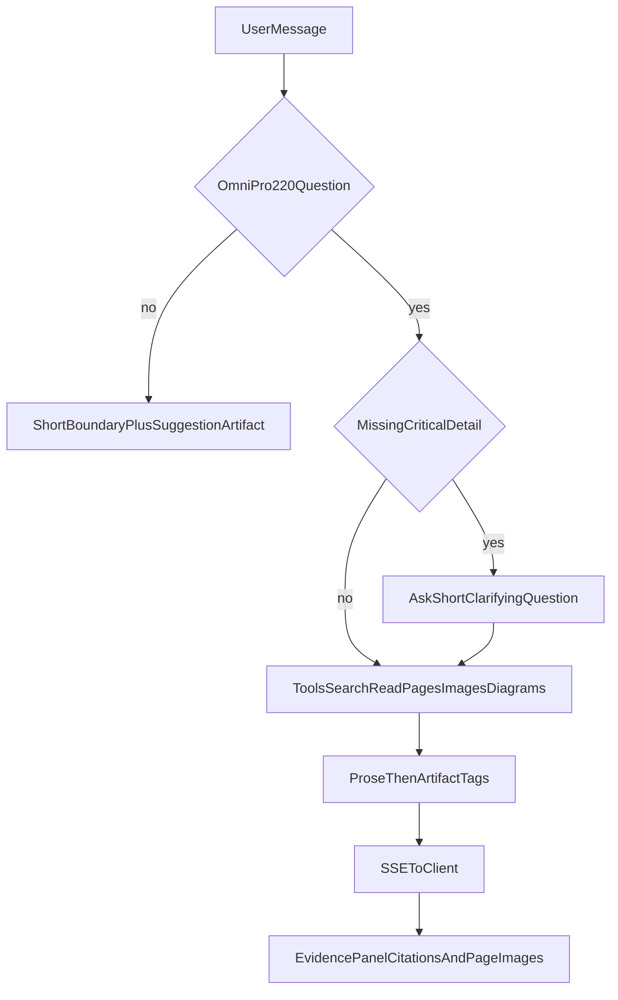

# OmniPro 220 Technical Support Agent

Multimodal technical support for the **Vulcan OmniPro 220** multiprocess welder: answers grounded in the owner’s manuals, with citations, manual page images, diagrams, and interactive artifacts (tables, flowcharts, calculators). Built for the [Prox Founding Engineer Challenge](https://useprox.com/join/challenge).

## Demo

| | |
| --- | --- |
| **Live app** | `https://prox-challenge-ibz-arain.vercel.app/` |
| **Video walkthrough** | `https://www.youtube.com/watch?v=lpVg2lxntsc` |

## What it does

- **Chat + evidence UI** — Ask in plain language or **attach a photo** (panel, weld, error screen, wiring). The model can use the image together with the manuals. Replies stream in; the side panel shows **sources**, **page excerpts**, and **page images** from the PDFs.
- **Starter prompts** — The landing UI includes suggested questions you can click to load into the chat.
- **Product-scoped** — Off-topic questions get a short boundary response and suggested OmniPro questions, not a general chat rabbit hole.
- **Manuals from `files/`** — PDFs are indexed locally; retrieval and page rendering power the agent tools.

## How the agent works

1. The Next.js app sends the conversation to **`POST /api/chat`** ([`app/api/chat/route.ts`](app/api/chat/route.ts)), which runs **`runAgent`** ([`lib/agent/index.ts`](lib/agent/index.ts)) against the Anthropic **Messages API** with **tool use** in a loop until the model finishes.
2. **Tools** ([`lib/agent/tools.ts`](lib/agent/tools.ts)): `search_manual`, `search_manual_multi`, `get_page`, `get_page_bundle`, `get_page_image`, `get_visual_context`, `get_diagram`, `lookup_specs`. They read from the built search index, full page text, rendered page PNGs, a small **diagram catalog**, and spec helpers.
3. **System behavior** ([`lib/agent/system-prompt.ts`](lib/agent/system-prompt.ts)): scope guard (OmniPro-related vs not), when to search vs reuse the thread, when to ask for process/thickness/voltage, safety notes, and rules for **`<artifact>`** blocks in the reply.
4. **Streaming** — Token text is sent over SSE; `<artifact>...</artifact>` segments are parsed and rendered by [`components/artifacts/ArtifactRenderer.tsx`](components/artifacts/ArtifactRenderer.tsx) (tables, SVG diagrams, flowcharts, calculators, HTML, etc.).

## Multimodal response flow



For off-topic requests the model does **not** call tools; for in-scope technical questions it retrieves from the manual, then answers with at least one line of prose before any artifacts.

## Design decisions

- **Messages API + custom tool loop** instead of the Claude Agent SDK: this app is a web chat with streaming and UI-owned tool execution, not an autonomous coding agent with a sandbox. Same agentic pattern (prompt → tools → loop → answer), full control over events and rendering.
- **Purpose-built tools** (search, pages, images, diagrams, specs) instead of a single “dump context” retrieval step, so the model can cross-reference like a human using a manual.
- **`<artifact>` protocol** so structured outputs become real UI: tables, SVGs, interactive flowcharts, calculators, and small HTML widgets—not text-only answers for spatial or procedural topics.
- **Evidence panel** so every substantive claim is inspectable (page number, excerpt, image).
- **Lazy index build** on first chat request (search index and assets are created when needed).
- **Tone and accuracy** — Written for a capable owner in a garage; the manual is the source of truth for numbers and wiring—no guessing or interpolating missing specs.

## Knowledge extraction and representation

1. **Ingestion** ([`scripts/ingest.ts`](scripts/ingest.ts), [`lib/ingest/`](lib/ingest/)): PDFs under **`files/`** are parsed with **pdf.js**; very low-text pages go through **Claude vision** for structured text. Pages get light metadata (section, content type). A **MiniSearch** index is written to **`generated/`** (gitignored), along with **`pages.json`** and status.
2. **Images** — Page renders for evidence live under **`public/manual-pages/`** and **`generated/page-images/`** as the pipeline runs.
3. **At runtime** the agent searches and fetches page text and, when needed, page images and catalog diagrams—represented as JSON-backed search hits and file-backed PNGs served to the UI.

## How to run it

```bash
git clone https://github.com/ibz-arain/prox-challenge.git
cd prox-challenge
cp .env.example .env
npm install
npm run dev
```

Set `ANTHROPIC_API_KEY` in `.env` ([Anthropic Console](https://console.anthropic.com/)). Open **http://localhost:3000**. The chat uses **Claude Sonnet 4** (`claude-sonnet-4-20250514`).
